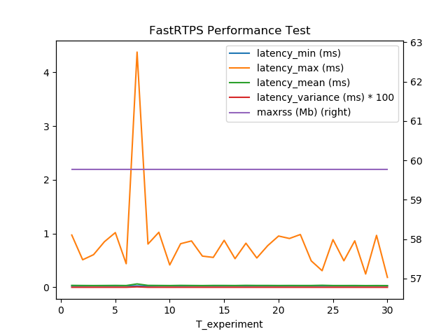
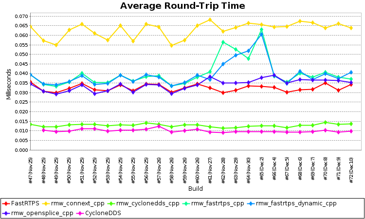
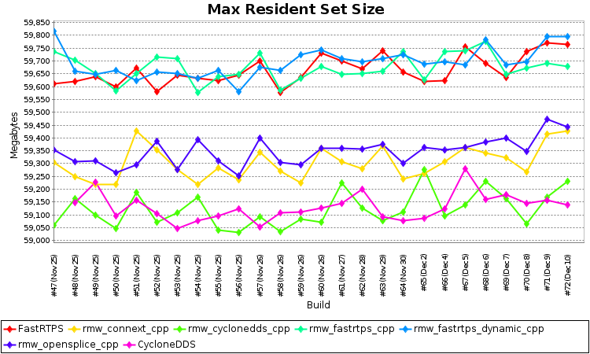
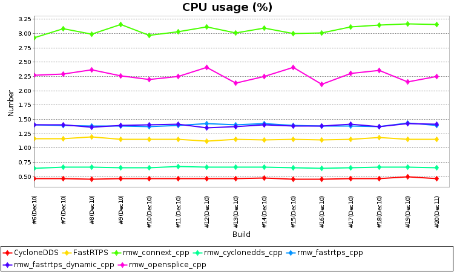
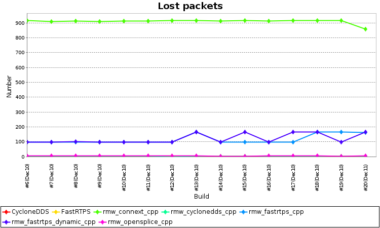
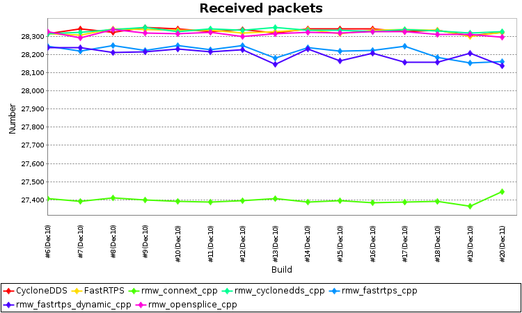
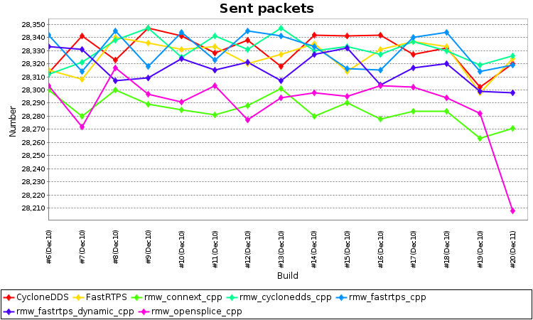

# buildfarm perf tests

## Purpose

This package defines some tests. On one hand it invokes `perf_test` from Apex.AI's [performance_test](https://gitlab.com/ApexAI/performance_test) package. This allows you to test performance and latency of several ROS 2 RMW implementations. On the other hand we are evaluating the additional overhead caused by a single pub-sub topic or one process spinning and detect potential leaks related to theses activities.

* There is a test for each RMW:

  - CycloneDDS (standalone test)
  - FastRTPS (standalone test)
  - rmw_connext_cpp
  - rmw_cyclonedds_cpp
  - rmw_fastrtps_cpp
  - rmw_fastrtps_dynamic_cpp
  - rmw_opensplice_cpp

### Test 1 - Performance Test  (APEX.AI)

In this test we are running the Performance Test provided by APEX.AI. Right now we have [our own fork](https://github.com/ros2/performance_test) because there are some pending pull requests in the official gitlab repository.

In this test we are measurement:
 - Average round-trip time
 - CPU usage (provided by APEX.AI tool)
 - Sent/Received packets per second
 - Total lost packets
 - Max resident set size

We are generating two plots per measurement
 - [One per-build](http://build.ros2.org/view/Eci/job/Eci__nightly-performance_ubuntu_bionic_amd64/lastBuild/)
 - [Other over time](http://build.ros2.org/view/Eci/job/Eci__nightly-performance_ubuntu_bionic_amd64/plot/)

**The test only measure the latency between the same rmw implementation**

| Publisher/Subscriber     | rmw_fastrtps_cpp         | rmw_opensplice_cpp       | rmw_cyclonedds_cpp       | rmw_fastrtps_dynamic_cpp | rmw_connext_cpp          |
|--------------------------|--------------------------|--------------------------|--------------------------|--------------------------|--------------------------|
| rmw_fastrtps_cpp         | :heavy_check_mark:       | :heavy_multiplication_x: | :heavy_multiplication_x: | :heavy_multiplication_x: | :heavy_multiplication_x: |
| rmw_opensplice_cpp       | :heavy_multiplication_x: | :heavy_check_mark:       | :heavy_multiplication_x: | :heavy_multiplication_x: | :heavy_multiplication_x: |
| rmw_cyclonedds_cpp       | :heavy_multiplication_x: | :heavy_multiplication_x: | :heavy_check_mark:       | :heavy_multiplication_x: | :heavy_multiplication_x: |
| rmw_fastrtps_dynamic_cpp | :heavy_multiplication_x: | :heavy_multiplication_x: | :heavy_multiplication_x: | :heavy_check_mark:       | :heavy_multiplication_x: |
| rmw_connext_cpp          | :heavy_multiplication_x: | :heavy_multiplication_x: | :heavy_multiplication_x: | :heavy_multiplication_x: | :heavy_check_mark:       |

## Test 2 - Simple pub/sub

In this case we are testing one publisher and one subscriber **in different processes** sending a 1kArray at 5Hz. This will allow us to
 evaluate additional overhead caused by a single pub-sub topic and detect leaks related to this
activity.

We measurement for both publisher and subscriber:

 - Average round trip
 - CPU usage ( readed from the filesystem )
 - Total lost packets
 - Received/Sent packets
 - Physical memory (Mb)
 - Resident anonymous memory (Mb)
 - Virtual memory (Mb)

Again we plot measurement:
 - [One per-build](http://3.83.10.11/job/Dci__nightly-performance-overhead-multi_ubuntu_bionic_amd64/lastBuild/)
 - [Other over time](http://3.83.10.11/job/Dci__nightly-performance-overhead-multi_ubuntu_bionic_amd64/plot/)

| Publisher/Subscriber     | rmw_fastrtps_cpp   | rmw_opensplice_cpp | rmw_cyclonedds_cpp | rmw_fastrtps_dynamic_cpp | rmw_connext_cpp    |
|--------------------------|--------------------|--------------------|--------------------|--------------------------|--------------------|
| rmw_fastrtps_cpp         | :heavy_check_mark: | :heavy_check_mark: | :heavy_check_mark: | :heavy_check_mark:       | :heavy_check_mark: |
| rmw_opensplice_cpp       | :heavy_check_mark: | :heavy_check_mark: | :heavy_check_mark: | :heavy_check_mark:       | :heavy_check_mark: |
| rmw_cyclonedds_cpp       | :heavy_check_mark: | :heavy_check_mark: | :heavy_check_mark: | :heavy_check_mark:       | :heavy_check_mark: |
| rmw_fastrtps_dynamic_cpp | :heavy_check_mark: | :heavy_check_mark: | :heavy_check_mark: | :heavy_check_mark:       | :heavy_check_mark: |
| rmw_connext_cpp          | :heavy_check_mark: | :heavy_check_mark: | :heavy_check_mark: | :heavy_check_mark:       | :heavy_check_mark: |

## Test 3 - Node spinning

This test creates one process and spins for 1 minute to evaluate ROS 2 overhead and detect obvious leaks.

We measure:

 - CPU usage ( readed from file system )
 - Physical memory
 - Resident anonymous memory
 - Virtual memory

Again we plot measurement:
 - [One per-build](http://3.83.10.11/job/Dci__nightly-performance-overhead_ubuntu_bionic_amd64/lastBuild/)
 - [Other over time](http://3.83.10.11/job/Dci__nightly-performance-overhead_ubuntu_bionic_amd64/plot/Node%20Spinnig%20Results/)

| DDS                      | Process 1 |
|--------------------------|-----------|
| rmw_fastrtps_cpp         | :heavy_check_mark:   |
| rmw_opensplice_cpp       |  :heavy_check_mark:   |
| rmw_cyclonedds_cpp       | :heavy_check_mark:   |
| rmw_fastrtps_dynamic_cpp |  :heavy_check_mark:   |
| rmw_connext_cpp          |   :heavy_check_mark:   |

##  Build

1.  Install ROS 2 (https://index.ros.org/doc/ros2/Installation/).
1.  Source the ROS 2 installation (either `/opt/ros/<rosdistro>/setup.bash` if installing from binaries, or `~/ros2_ws/install/setup.bash` if building from source):
    1.  `source /opt/ros/<rosdistro>/setup.bash` or `source ~/ros2_ws/install/setup.bash`
1.  Make a new workspace and clone this repository into it:
    1.  `mkdir -p ~/performance_ws/src`
    1.  `cd ~/performance_ws`
    1.  `wget https://github.com/ros2/buildfarm_perf_tests/raw/master/tools/ros2_dependencies.repos`
    1.  `vcs import src < ros2_dependencies.repos`
1.  Build the local workspace:
    1.  `colcon build`
1.  Source the local workspace:
    1.  `source install/local_setup.bash`

### Run

```bash
colcon test --packages-select buildfarm_perf_tests -DPERF_TEST_MAX_RUNTIME="30" -DPERF_TEST_TOPIC="Array1k" --event-handlers console_direct+
```

Add at the end the flags `--event-handlers console_direct+` if you want to visualize all the output.

## Details

* Each test runs for **30** seconds with a **1k payload**, but this can be changed using CMake variables.
 - `PERF_TEST_MAX_RUNTIME`: Maximum number of seconds to run before  exiting. Zero runs forever.
 - `PERF_TEST_TOPIC`: Topic to use. These are all available topics: `Array1k`, `Array4k`, `Array16k`, `Array32k`, `Array60k`, `Array1m`, `Array2m`, `Struct16`, `Struct256`, `Struct4k`, `Struct32k`, `PointCloud512k`, `PointCloud1m`, `PointCloud2m`, `PointCloud4m`, `Range`, `NavSatFix`, `RadarDetection` and `RadarTrack`.

For example, If we want to run the test during `30` seconds using the topic `Array1k`:

```bash
colcon build --packages-select buildfarm_perf_tests --cmake-args -DPERF_TEST_MAX_RUNTIME="30" -DPERF_TEST_TOPIC="Array1k"
```

* Each test produces a PNG plot of [various measures](http://build.ros2.org/view/Eci/job/Eci__nightly-performance_ubuntu_bionic_amd64/) across time, displayed in Jenkins using the image gallery plugin.
  - These plots are displayed on the build's summary page, and are part of the output artifacts for the build.


* Each test also produces a couple of [aggregated measures](http://build.ros2.org/view/Eci/job/Eci__nightly-performance_ubuntu_bionic_amd64/plot/) in a small csv file, used to plot build-over-build using the Jenkins plot plugin.

   - To see these plots, click the "Plots" link on the left side of the JOB summary (not a build summary)
   - You should be able to click one of those points to jump to the aforementioned PNG plot that produced that aggregated point.






